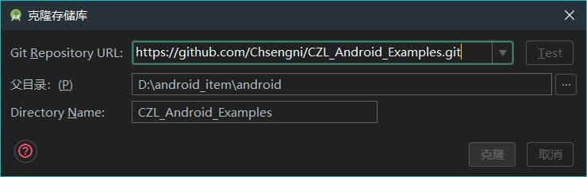
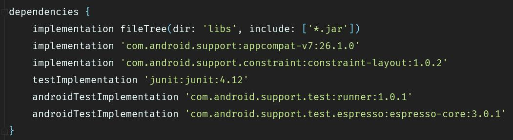
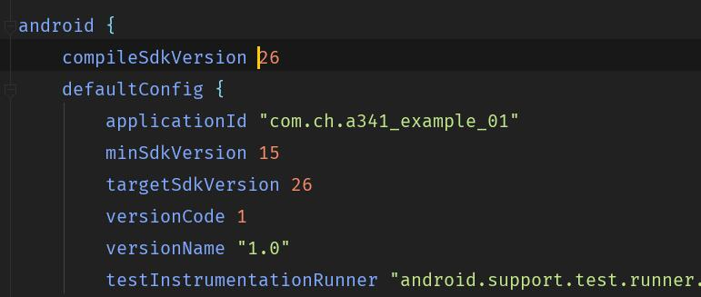

# Android Studio 移动开发教程

### 【1】介绍
	[编著] :肖琨 吴志祥 史兴燕 张智
	[出版社]:电子工业出版社
	
### 【2】获取源码
复制打开git粘贴即可

	git clone https://github.com/Chsengni/CZL_Android_Examples.git

Android Studio 上 主界面选择 

	Check out project from Version Control
复制

	https://github.com/Chsengni/CZL_Android_Examples.git
	
选择 Git

【3】依赖配置

可自行修改

【4】作者

联系方式：
 2371778707